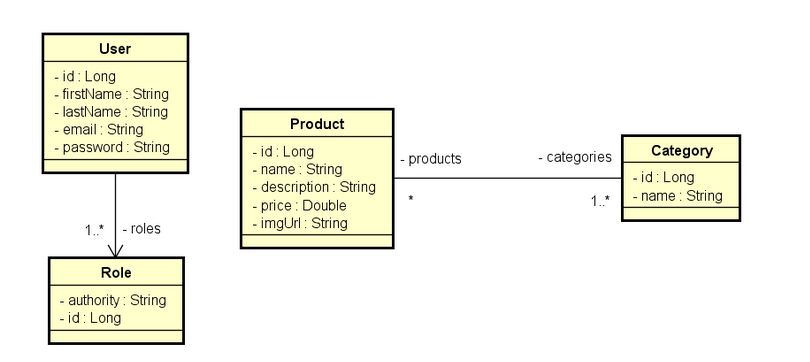

# Webshop Catalog

****

Webshop catalog é uma aplicação fullstack, que consiste em um
catálogo para controle de produtos, com separação para usuários e administradores.

Aplicação desenvolvida usando padrão monorepo.
****
## Modelo de domínio

****
## Padrões e conceitos utilizados
- Padrão cache aside com Redis: Cache MISS realiza uma consulta ao banco e Cache HIT devolve o conteúdo em cache
- Arquitetura de 3 camadas: separação em controladores, serviços e repositórios
- Implementação dos príncipos ACID com JPA

****
## Tecnologias usadas

### Back end
****
- Java
- Spring Boot
- JPA/Hibernate
- Maven
- Redis
- OpenAPI
****
## Como executar

```bash
$ git clone git@github.com:paulohtolotti/webshop-catalog.git
$ cd webshop-catalog/backend 
$ ./mvnw spring-boot:run
```
